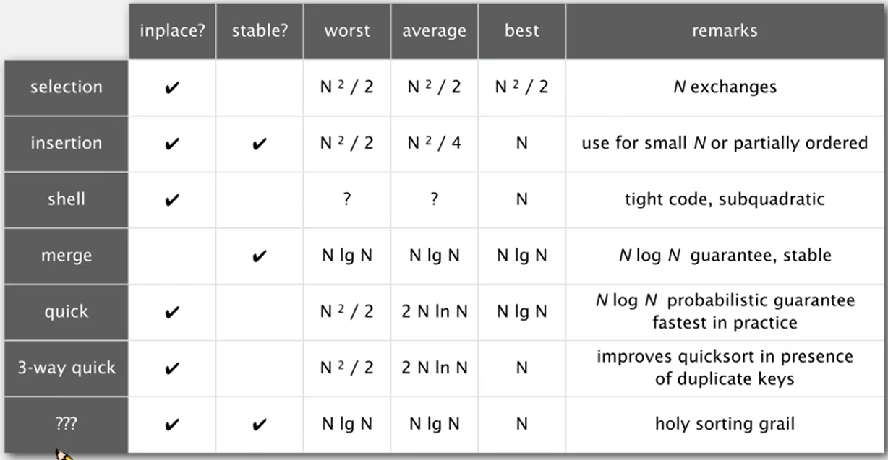

# Practical-Data-Structures-and-Algorithms-113-1-BIME
113-2 NTU BIME Class

作業題目網址:  
hw01(Union): https://hackmd.io/@CiqLOooyRwWmK--mMkfetA/SyieYHDP1l  
hw02(動態規劃 DP): https://hackmd.io/@CiqLOooyRwWmK--mMkfetA/B1BlzSwFJe  
hw03(單調棧 Monotonic Stack): https://hackmd.io/@CiqLOooyRwWmK--mMkfetA/S1edebLt5Jx  
Supplement 03_1: 分別用 Array 與 Linked List 實作 Stack, Queue. 矩陣實作的版本需要可以動態增減.  
Supplement 03_2: 循環鏈表, 雙向鏈表.  
hw04(凸殼 Convex Hull): https://hackmd.io/@CiqLOooyRwWmK--mMkfetA/HkzhEbmskl  
hw05: https://hackmd.io/@CiqLOooyRwWmK--mMkfetA/BJ7EdE2jye  
Supplement 05_1: 實作 Knuth Shuffle, Bubble Sort, Selection Sort, Insertion Sort, Shell Sort (分治的 Insert sort).  
Supplement 05_2: 實作 Merge Sort, Quick Sort (Median of 3), 3 Way Quick Sort.  
Supplement 05_3: 實作 Heap Sort.  

考慮用哪種 sort 應該要考慮
1. 穩定性:在遇到相同大小時不能交換，並且不可破壞上次排序的結果。通常只要不是鄰近兩兩交換的，都不穩定。(只有merge, insert sort是穩定)
2. 確定性:有一致的執行過程。快速排序因為一開始會洗牌，所以沒有確定性。
3. 平行度:快速排序無法平行化
4. 空間花費:merge sort需要額外空間保存分治過程，無法直接交換。

作業繳交網址:
https://c4lab.bime.ntu.edu.tw:13000/

課本提供函式庫:  
https://algs4.cs.princeton.edu/code/  
https://github.com/kevin-wayne/algs4/tree/master/src/main/java/edu/princeton/cs/algs4

