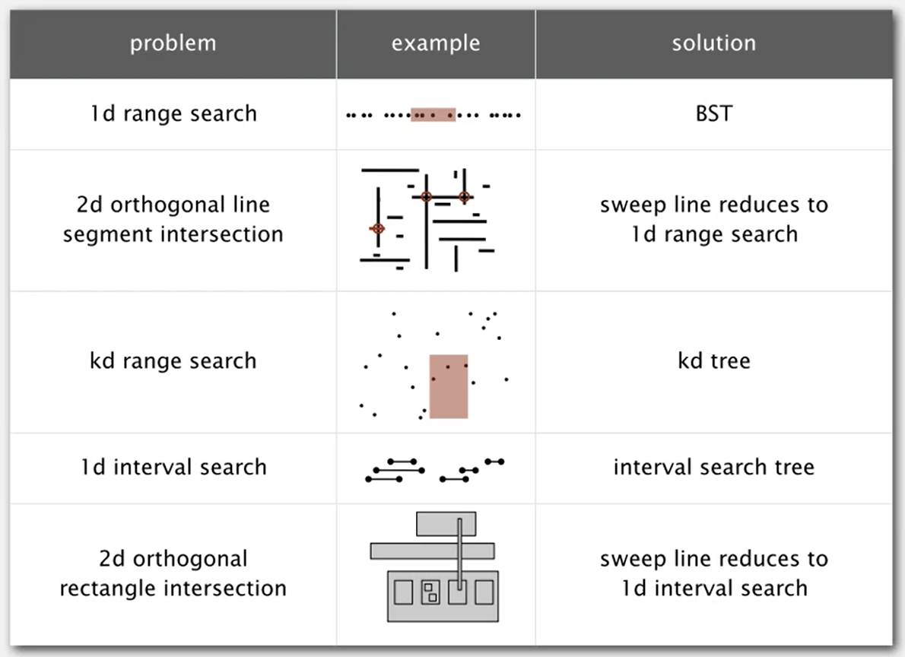

# Practical-Data-Structures-and-Algorithms-113-1-BIME
113-2 NTU BIME Class


# 作業題目網址:  
hw01(Union): https://hackmd.io/@CiqLOooyRwWmK--mMkfetA/SyieYHDP1l  
hw02(動態規劃 DP): https://hackmd.io/@CiqLOooyRwWmK--mMkfetA/B1BlzSwFJe  
hw03(單調棧 Monotonic Stack): https://hackmd.io/@CiqLOooyRwWmK--mMkfetA/S1edebLt5Jx  
Supplementary 03_1: 分別用 Array 與 Linked List 實作 Stack, Queue. 矩陣實作的版本需要可以動態增減.  
Supplementary 03_2: 循環鏈表, 雙向鏈表.  
hw04(凸殼 Convex Hull): https://hackmd.io/@CiqLOooyRwWmK--mMkfetA/HkzhEbmskl  
hw05: https://hackmd.io/@CiqLOooyRwWmK--mMkfetA/BJ7EdE2jye  
Supplementary 05_1: 實作 Knuth Shuffle, Bubble Sort, Selection Sort, Insertion Sort, Shell Sort (分治的 Insert sort).  
Supplementary 05_2: 實作 Merge Sort, Quick Sort (Median of 3), 3 Way Quick Sort.  
Supplementary 05_3: 實作 Heap Sort.  
hw06(Event Queue): https://hackmd.io/@CiqLOooyRwWmK--mMkfetA/r1jOYE2iye  
hw07(質心分群 centroid hierarchical clustering algorithm): https://hackmd.io/@CiqLOooyRwWmK--mMkfetA/HkHS8UcC1x  
Supplementary 07_1: 實作 紅黑樹 KD樹  
hw08(2D interval search): https://hackmd.io/@CiqLOooyRwWmK--mMkfetA/HkoBID501g  
hw09: https://hackmd.io/@CiqLOooyRwWmK--mMkfetA/SyROxKmlgg  


## 筆記
考慮用哪種 sort 應該要考慮  
1. 穩定性:在遇到相同大小時不能交換，並且不可破壞上次排序的結果。通常只要不是鄰近兩兩交換的，都不穩定。(只有merge, insert sort是穩定)  
2. 確定性:有一致的執行過程。快速排序因為一開始會洗牌，所以沒有確定性。  
3. 平行度:快速排序無法平行化  
4. 空間花費:merge sort需要額外空間保存分治過程，無法直接交換。  
  

Symbol Table 實作方法:  
1. linklist  
2. 雙陣列分別儲存 key, value。 放入時要排序，可以使用 binary search。  
3. Binary Search Tree (Hibbard Deletion)  
   ```
        10
       /  \
      5    20
          /  \
        15    30
   ```
	- case1. 刪除節點在最下面: 把 parent 的 link 設為 nullptr   
	- case2. 刪除節點的兩根腳只有一個有連接(另一個為空): 直接把 parent 的 link 連接到子節點  
	- case3. 刪除節點的兩根腳都有值: 找左邊的最大(往左走一步後往右走到底)或是右邊的最小(往右走一步後往左走到底)，來取代要被刪除的位置。  
  			具體方式為先把原本被取代(10)和要取代的(15)都先複製起來，把複製的要取代節點(15)兩腳都設為與被取代的相同。刪掉原本要取代的節點(15)(因為一定在最底部，所以很好刪)。  
			最後回傳新增的複製節點位置(15)，再手動把父節點或根節點的位置重新接到回傳值。被刪除的節點，因為沒人指到他會自己被回收。  
4. 遍歷二元樹的方法 preorder, inorder, postorder (https://www.shubo.io/iterative-binary-tree-traversal/)
5. 紅黑樹: https://www.bilibili.com/video/BV1piF6erE7Y?spm_id_from=333.788.videopod.sections&vd_source=a7ec40e3a00a70629191f9c178661833  


## 幾何搜尋
1. KD-tree: 應用於 range search & nearest neighbor (113-2-PDSA-20250502-h2)  
2. interval search tree (113-2-PDSA-20250502-h2)
   

## 圖
1. 無向圖
   
   
   
   
   
    <!-- 迴圈內比一開始初始化多了edgeTo[w]=v，還有distTo[w]邏輯不同 -->
   
   
   
    <!-- 4.biconnected compoment指的是，有沒有點移除以後會導致CC失效的。 -->
   <!-- 6. 尤拉路徑: 一筆畫，每個邊只能經過一次(簡單)。 -->
   <!-- 7. 漢米爾頓路徑: 一筆畫，每個頂點只能經過一次(超難)。 -->
   <!-- 8. Bipartite graph (二分圖): 所有頂點分為兩群(紅、白)，所有紅點只能連到白點，所有白點只能連到紅點。-->
   <!-- 9. planarity 畫出平面圖，沒有邊交叉(重疊)。 -->
   <!-- 10. 在交換元素後，問兩張圖是不是一樣。 -->

2. 有向圖
   拓樸排序 Directed acyclic graph, (DAG)  
   使用 DST + stack 紀錄結果  
   結果不唯一  
   DAG 一定沒有迴圈  
3. Minumum Spanning Tree, (MST) 最小生成樹 (假設圖都連接、每個邊的權重都不同，這樣結果必定唯一。)
   原本的圖可能會有多個冗餘的邊，如何用最少的邊，把圖中的所有頂點連起來。  
   其中生成樹的所有邊必須相連(不能是兩個斷開的子圖)，必定沒有迴圈。  
4. 圖的 cut property (必考):
   - 【性質定義】
      任意切一刀，把圖中的點分為兩群，刀子經過的邊為 crossing edge。  
      該圖的MST路徑，必定包含所有 crossing edge 當中，權重最小的 crossing edge。
   - 【證明-反證法】(必考):
      假設我們的最小生成樹（MST）沒有包含這條權重最小的 crossing edge（記為 e），
      那麼 MST 必定包含其他 crossing edge（記為 f），因為要連接兩邊的點，所以必定會使用到 crossing edge。
      因為 e 的權重比 f 小（e 是所有 crossing edge 中最小的），
      如果我們把 MST 中的 f 換成 e，新的樹會比原本的 MST 權重更小。
      這代表使用 f 的 MST 違反了「最小」的定義。
      因此，假設不成立，所有 crossing edge 中權重最小的那一條，一定會在 MST 當中。

      

5. 貪心 MST 算法:
   每次切一刀後，得到 minumum crossing edge 的兩個點。  
   在以後切的時候，都必須在同一邊，不能被切開。  
   重複切 v-1 次，即可得到 MST。
   不管怎麼切，只要滿足MST一開始的假設，結果就唯一。
   1. Kruskal
      把所有 edge 的權重排序，從權重低的開始當作 MST 的成員。  
      如果加入這個 edge 後會形成 cycle 則跳過，直到選中 v-1 個 edge。  
      (如果跑完所有邊也行，但就多浪費時間，不影響結果。)  
   2. Prim 0516-h3


# 作業繳交網址:
https://c4lab.bime.ntu.edu.tw:13000/


# 課本提供函式庫:  
https://algs4.cs.princeton.edu/code/  
https://github.com/kevin-wayne/algs4/tree/master/src/main/java/edu/princeton/cs/algs4

