# tree、Symbol Table
考慮用哪種 sort 應該要考慮  
1. 穩定性:在遇到相同大小時不能交換，並且不可破壞上次排序的結果。通常只要不是鄰近兩兩交換的，都不穩定。(只有merge, insert sort是穩定)  
2. 確定性:有一致的執行過程。快速排序因為一開始會洗牌，所以沒有確定性。  
3. 平行度:快速排序無法平行化  
4. 空間花費:merge sort需要額外空間保存分治過程，無法直接交換。  
  

Symbol Table 實作方法:  
1. linklist  
2. 雙陣列分別儲存 key, value。 放入時要排序，可以使用 binary search。  
3. Binary Search Tree (Hibbard Deletion)  
   ```
        10
       /  \
      5    20
          /  \
        15    30
   ```
	- case1. 刪除節點在最下面: 把 parent 的 link 設為 nullptr   
	- case2. 刪除節點的兩根腳只有一個有連接(另一個為空): 直接把 parent 的 link 連接到子節點  
	- case3. 刪除節點的兩根腳都有值: 找左邊的最大(往左走一步後往右走到底)或是右邊的最小(往右走一步後往左走到底)，來取代要被刪除的位置。  
  			具體方式為先把原本被取代(10)和要取代的(15)都先複製起來，把複製的要取代節點(15)兩腳都設為與被取代的相同。刪掉原本要取代的節點(15)(因為一定在最底部，所以很好刪)。  
			最後回傳新增的複製節點位置(15)，再手動把父節點或根節點的位置重新接到回傳值。被刪除的節點，因為沒人指到他會自己被回收。  
4. 遍歷二元樹的方法 preorder, inorder, postorder (https://www.shubo.io/iterative-binary-tree-traversal/)
5. 紅黑樹: https://www.bilibili.com/video/BV1piF6erE7Y?spm_id_from=333.788.videopod.sections&vd_source=a7ec40e3a00a70629191f9c178661833  


# 幾何搜尋
1. KD-tree: 應用於 range search & nearest neighbor (113-2-PDSA-20250502-h2)  
2. interval search tree (113-2-PDSA-20250502-h2)
   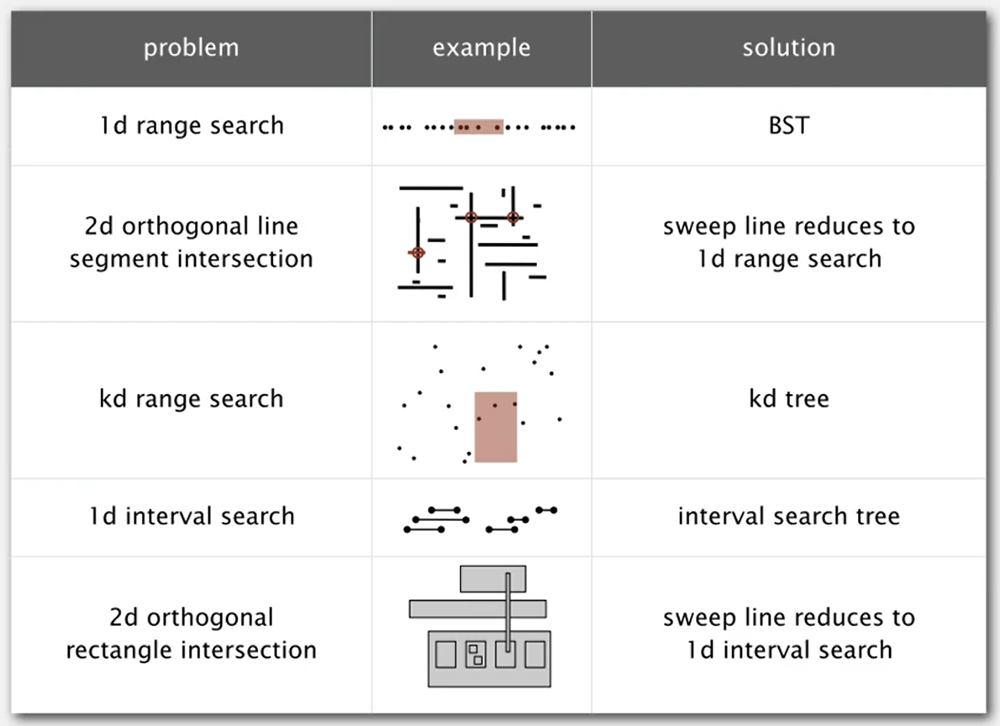

# 圖
1. 無向圖
   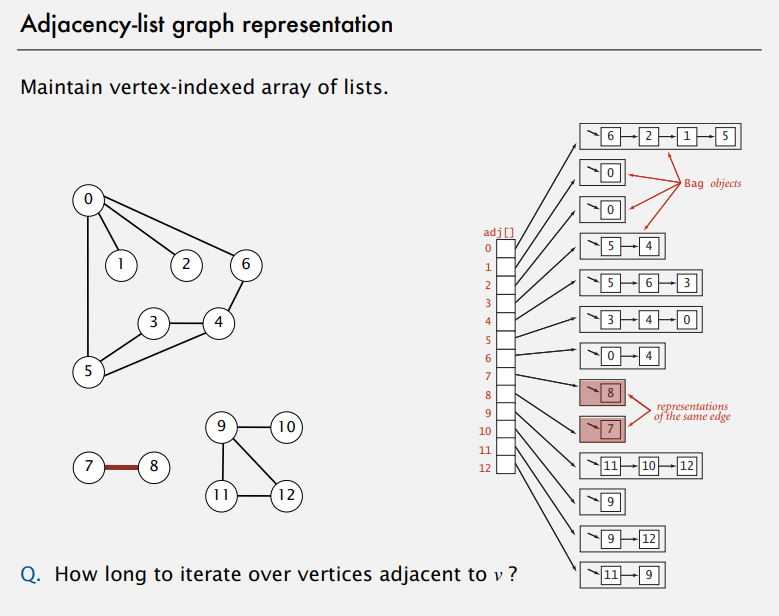 鄰接表概念
   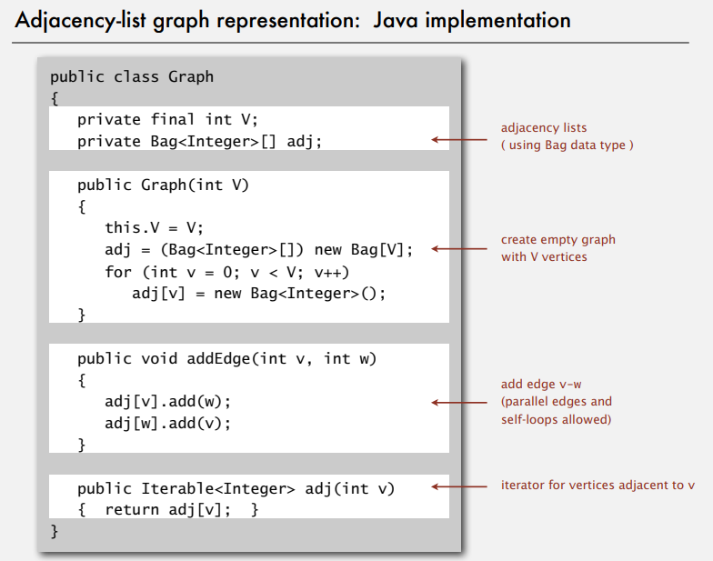 鄰接表實作  
   其中Bag是一種 linklist 代表裡面存放的資料 1.無序, 2.可重複  
   例如可以重複執行兩次 adj[v].add(w)，這代表V和W之間有兩條路徑。  
   `(Bag<Edge>[]) new Bag[V];`代表建立V個Bag(linklist)的容器(尚未建立實例)，前面的()代表讓編譯器檢查，linklist內只能存入Edge。但如果用特殊方法繞開編譯器，讓執行時存不同東西到Bag內，根本不會檢查。
   `new Bag<Edge>()`建立Bag的實例。並且實際限制每個Bag的add方法，只能加入Edge。
   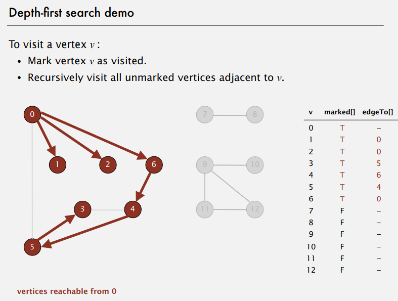 DFS概念
    DFS實作
    BFS概念
   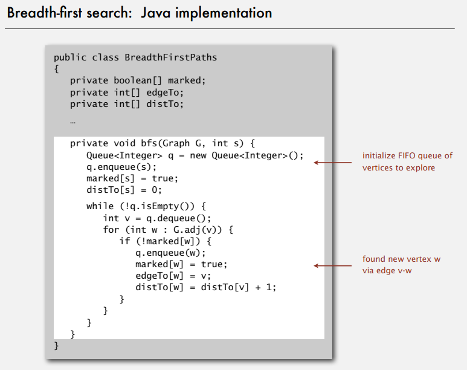 BFS實作 <!-- 迴圈內比一開始初始化多了edgeTo[w]=v，還有distTo[w]邏輯不同 -->
   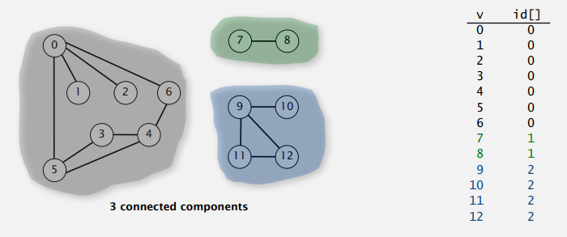 連通分量(CC)概念
    連通分量(CC)  
   `marked [v]`紀錄每個頂點有無被搜尋過，  
   `id [v]`紀錄每個頂點所屬的CC編號，  
   `count`總共有幾組CC。  
   構造函數遍歷每個頂點，如果還沒掃過，就用dfs掃所有連通的點，並且設定同樣的CC編號(id)，最後count+1。
   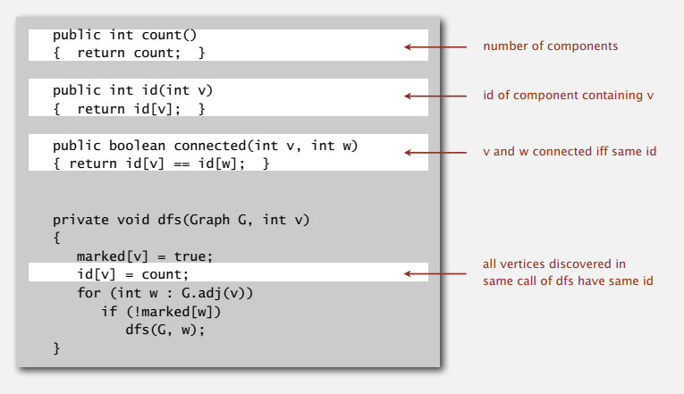 連通分量(CC)實作2  
   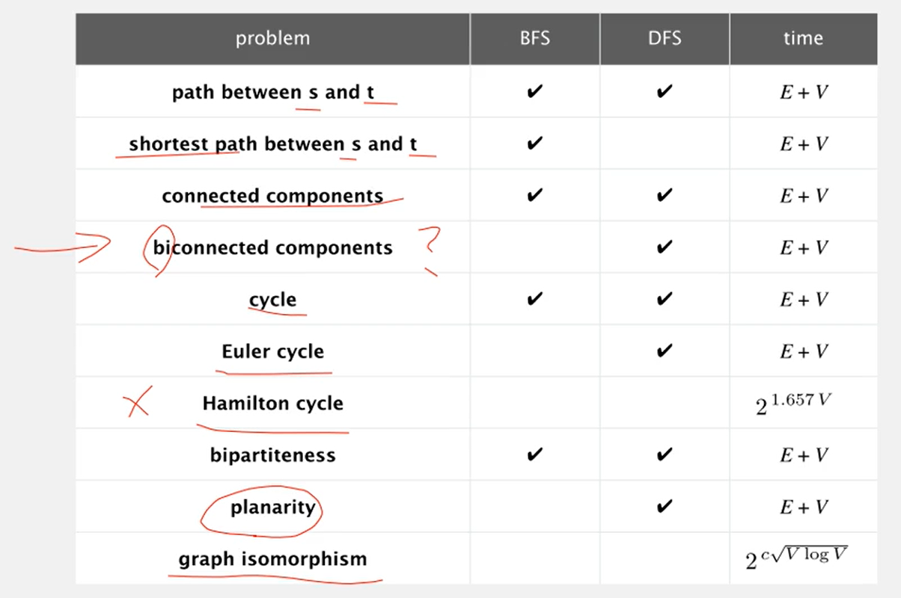 難度 <!-- 4.biconnected compoment指的是，有沒有點移除以後會導致CC失效的。 -->
   <!-- 6. 尤拉路徑: 一筆畫，每個邊只能經過一次(簡單)。 -->
   <!-- 7. 漢米爾頓路徑: 一筆畫，每個頂點只能經過一次(超難)。 -->
   <!-- 8. Bipartite graph (二分圖): 所有頂點分為兩群(紅、白)，所有紅點只能連到白點，所有白點只能連到紅點。-->
   <!-- 9. planarity 畫出平面圖，沒有邊交叉(重疊)。 -->
   <!-- 10. 在交換元素後，問兩張圖是不是一樣。 -->

2. 有向圖
   拓樸排序 Directed acyclic graph, (DAG)  
   使用 DST + stack 紀錄結果  
   結果不唯一  
   DAG 一定沒有迴圈  

3. Minumum Spanning Tree, (MST) 最小生成樹 (假設圖都連接、每個邊的權重都不同，這樣結果必定唯一。)
   原本的圖可能會有多個冗餘的邊，如何用最少的邊，把圖中的所有頂點連起來。  
   其中生成樹的所有邊必須相連(不能是兩個斷開的子圖)，必定沒有迴圈。  
   
4. 圖的 cut property (必考):
   - 【性質定義】
      任意切一刀，把圖中的點分為兩群，刀子經過的邊為 crossing edge。  
      該圖的MST路徑，必定包含所有 crossing edge 當中，權重最小的 crossing edge。

   - 【證明-反證法】(必考):
      假設我們的最小生成樹（MST）沒有包含這條權重最小的 crossing edge（記為 e），
      那麼 MST 必定包含其他 crossing edge（記為 f），因為要連接兩邊的點，所以必定會使用到 crossing edge。
      因為 e 的權重比 f 小（e 是所有 crossing edge 中最小的），
      如果我們把 MST 中的 f 換成 e，新的樹會比原本的 MST 權重更小。
      這代表使用 f 的 MST 違反了「最小」的定義。
      因此，假設不成立，所有 crossing edge 中權重最小的那一條，一定會在 MST 當中。
      

5. 貪心 MST 算法:
   每次切一刀後，得到 minumum crossing edge 的兩個點。  
   在以後切的時候，都必須在同一邊，不能被切開。  
   重複切 v-1 次，即可得到 MST。
   不管怎麼切，只要滿足MST一開始的假設，結果就唯一。
   1. Kruskal
      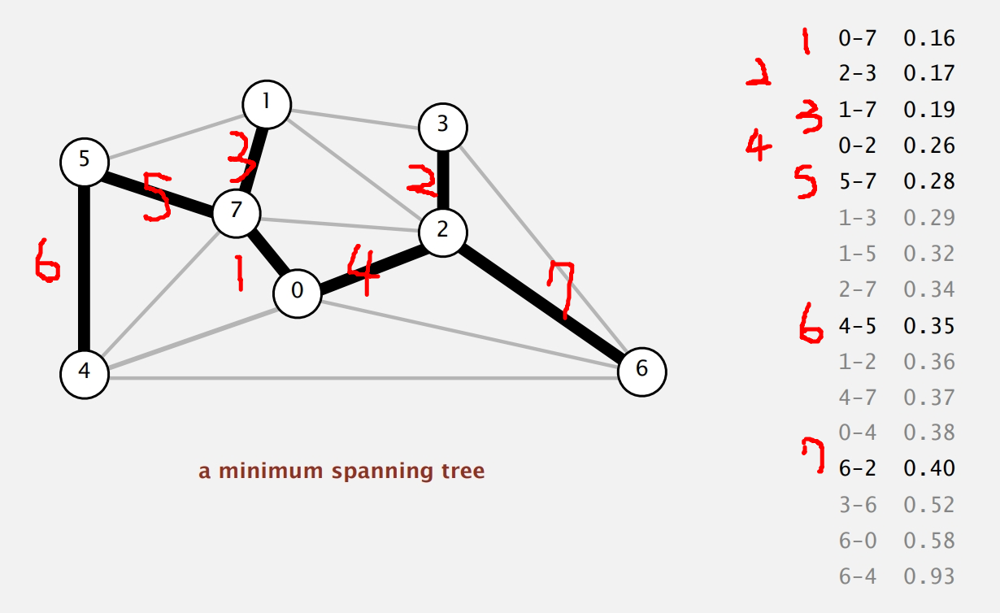
      - 【算法說明】
         1. **排序所有邊**：將所有邊按權重從小到大排序。
         2. **初始化 Union-find**：每個頂點初始時屬於自己的獨立集合（即父節點指向自己）。
         3. **貪心選擇邊**：檢查每條邊的兩個頂點 (u, v) 是否屬於同一集合，使用 Union-Find 判斷根結點是否相同。
            1. **若屬於不同集合**（即 find(u) != find(v)）：將這條邊加入 MST，並且用 Union 操作合併 u 和 v 所屬的集合。(這代表這條邊不會形成cycle，並且邊的兩個點，在以後切的時候，都必須在同一邊，不能被切開。)
            2. **若屬於同一集合**（即 find(u) == find(v)）：跳過這條邊（加入它會形成環）。
         4. **終止條件**：當已選中 V−1 條邊時停止（V 為頂點數）。(如果跑完所有邊也行，但就多浪費時間，不影響結果。)  

      - 【程式實作】
         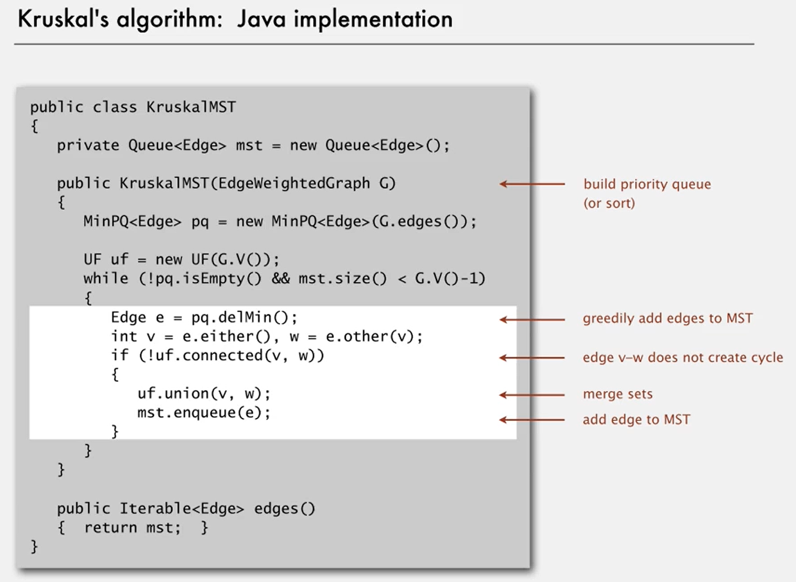 kruskal MST 實作  
         ```java
         public class KruskalMST {
         private Queue<Edge> mst = new Queue<Edge>();  // 用於儲存 MST 的邊

         public KruskalMST(EdgeWeightedGraph G) {
            // 1. 排序所有邊
            MinPQ<Edge> pq = new MinPQ<Edge>(G.edges());
            // 2. 初始化 Union-find
            UF uf = new UF(G.V());

            // 3. 貪心選擇邊 & 4. 終止條件
            // 當優先級佇列不為空且 MST 的邊數未達到 V-1 時繼續循環
            while (!pq.isEmpty() && mst.size() < G.V() - 1) {

                  // 取得最小邊與對應的兩個頂點
                  Edge e = pq.delMin();  // 取出當前權重最小的邊
                  int v = e.either();    // 獲取邊的一個頂點
                  int w = e.other(v);    // 獲取邊的另一個頂點

                  // 如果兩個頂點屬於不同的Union才合併並且加入MST（避免環）
                  // 如果不滿足則跳過
                  if (!uf.connected(v, w)) {
                     uf.union(v, w);    // 合併兩個Union
                     mst.enqueue(e);    // 將邊加入 MST
                  }
            }
         }

         // 返回 MST 的所有邊
         public Iterable<Edge> edges() {
            return mst;
         }
      }
         ```


   2. Prim   
      從一個頂點開始，逐步擴張MST的邊界，每次從MST鄰近的邊中選擇權重最小的。  
      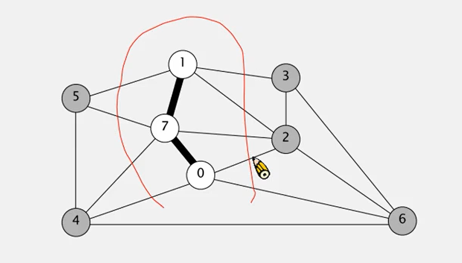
      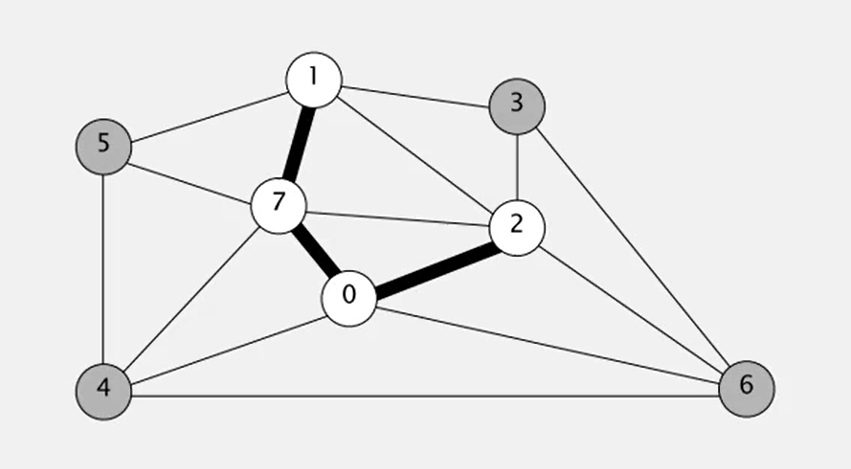

      - 【lazy 懶惰算法說明】把edge放到優先佇列  
         使用優先級佇列（最小堆）儲存所有邊，可能包含無效邊（已加入MST的頂點）。  
         1. **初始化**：選擇任意起點為MST，將其鄰接邊加入優先級佇列。
         2. **擴張樹**：
            - 從優先級佇列中取出最小權重邊`(u, v)`，其中u是本來就在MST當中的點，v可能在MST中也可能不在。
            - 若`v`不在MST當中，將`(u, v)`加入MST，並將`v`的鄰接邊加入佇列
            - 若`v`已經在MST當中(兩個點都已經在MST當中)，跳過（此為無效邊）
         3. **終止條件**：當MST包含`V−1`條邊時停止

      - 【lazy 實作】
         ```java
         public class LazyPrimMST {
            private boolean[] marked; // 標記頂點是否已在MST中  
            private Queue<Edge> mst;  // 用於存儲MST的邊  
            private MinPQ<Edge> pq;   // 優先級隊列（最小堆），用於獲取最小權重邊

            public LazyPrimMST(WeightedGraph G) {
               pq = new MinPQ<Edge>();  // 初始化優先級隊列
               mst = new Queue<Edge>(); // 初始化MST邊集合
               marked = new boolean[G.V()]; // 初始化標記數組
               visit(G, 0); // 從頂點0開始構建MST（可選任意頂點）

               // 當優先級隊列不為空且MST邊數未達到V-1時繼續循環
               while (!pq.isEmpty() && mst.size() < G.V() - 1) {
                     Edge e = pq.delMin(); // 取出當前最小權重邊
                     int v = e.either(), w = e.other(v); // 獲取邊的兩個頂點
                     
                     // 如果兩個頂點都已標記，則跳過（避免環）
                     if (marked[v] && marked[w]) continue;
                     
                     mst.enqueue(e); // 將有效邊加入MST
                     
                     // 將未訪問的頂點加入樹，並訪問其鄰接邊
                     if (!marked[v]) visit(G, v);
                     if (!marked[w]) visit(G, w);
               }
            }

            // 從頂點v開始構建MST
            // 將v標記為已訪問，並將其鄰接邊加入優先級隊列
            private void visit(WeightedGraph G, int v) {
               marked[v] = true; // 標記頂點v已訪問
               for (Edge e : G.adj(v)) { // 遍歷v的所有鄰接邊
                     // 只將連接未訪問頂點的邊加入隊列（避免重複處理）
                     if (!marked[e.other(v)]) {
                        pq.insert(e);
                     }
               }
            }

            // 返回MST的所有邊
            public Iterable<Edge> edges() { 
               return mst; 
            }
         }
         ```

      - 【eager 積極算法說明】把vertex放到優先佇列  
         使用索引優先級佇列維護每個非樹頂點到樹的最小權重邊。  
         - 相對於lazy的優點:不會包含無效邊並且佇列長度使用V會比E更短。
         - 相對於lazy的缺點:實作較難，需要額外更新優先級佇列當中的權重(優先級)。  
         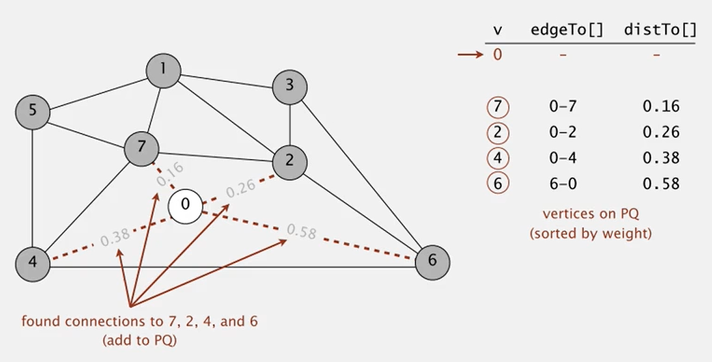  
         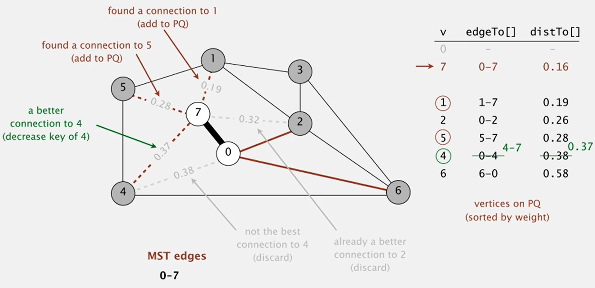
         第一次執行，MST當中只有0。  
         第二次執行MST當中有0, 7，此時T到4的權重需要更新。
         1. **初始化**：維護distTo[]陣列記錄每個頂點到樹的最小邊權重
         2. **擴張樹**：
            - 選擇distTo[]中最小的頂點v，將其對應的邊edgeTo[v]加入MST
            - 更新v的鄰居w的distTo[w]
         3. **終止條件**：當MST包含V−1條邊時停止

      - 【eager 算法實作】


   1. 比較
      1. Kruskal
         - 1
         - 
      2. prim
         - 1
         - 


6. weighted edge graph
   之前原本是用vertex(頂點)來建構圖，現在因為MST引入邊的權重，所以改成用edge(邊)來建構圖。
   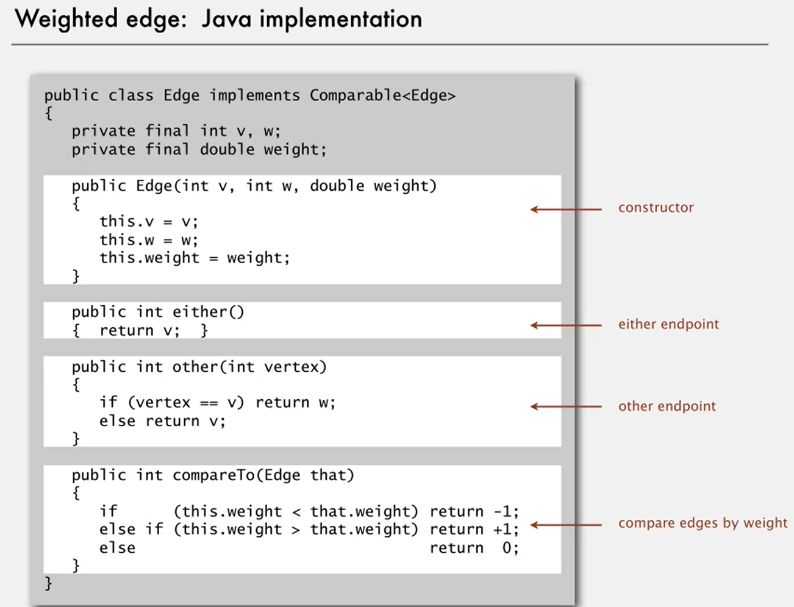 權重邊的實作
   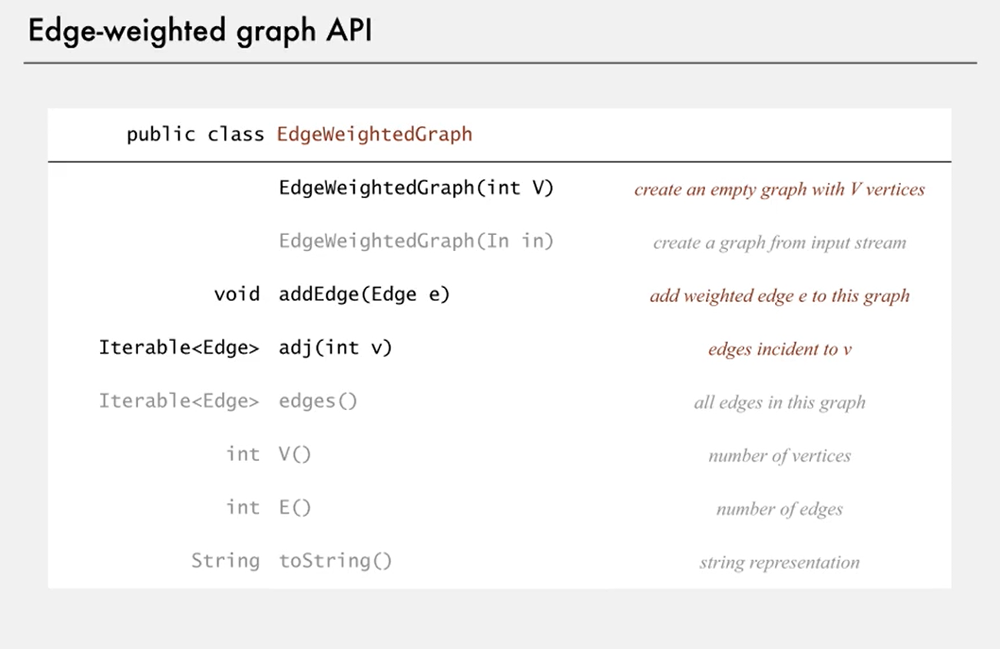 權重邊圖的架構
   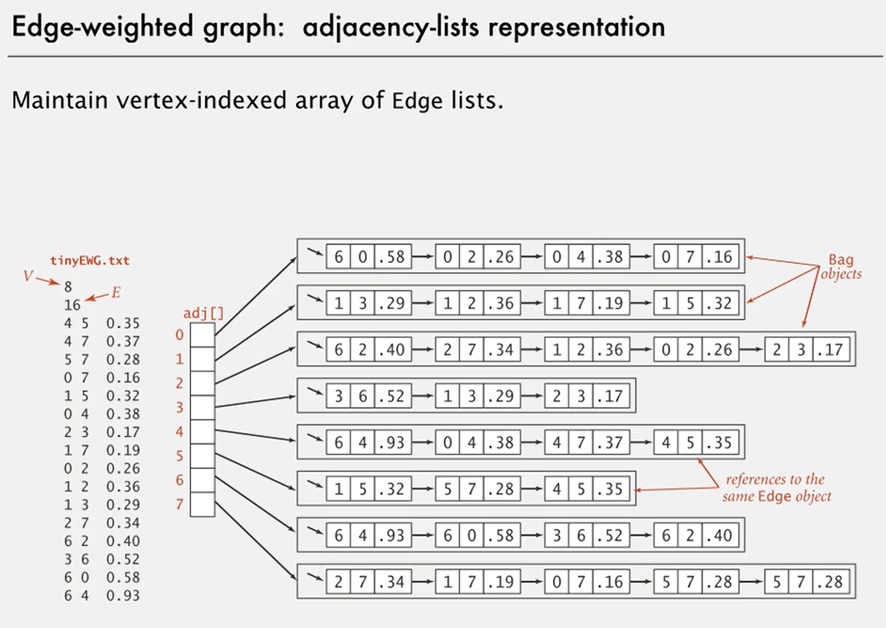 權重邊圖的鄰接表(頂點1, 頂點2, 權重)
   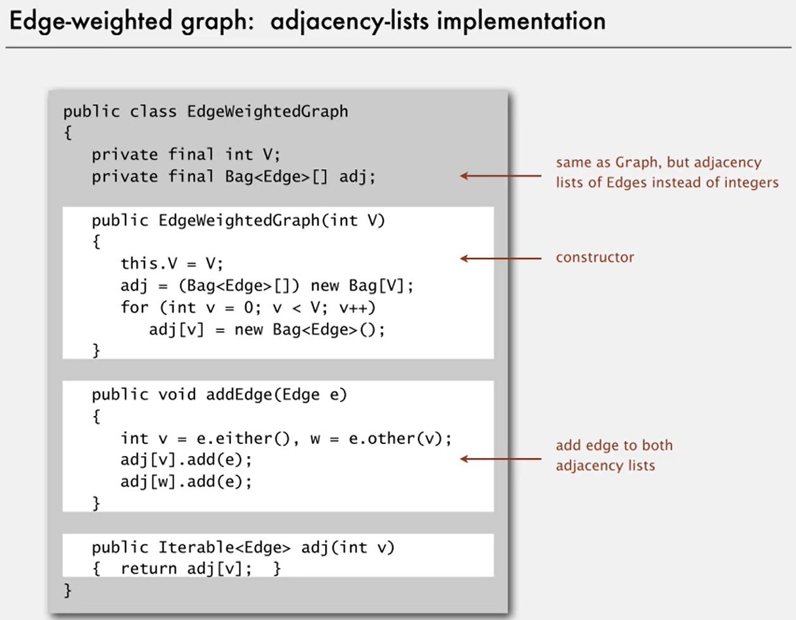 權重邊圖鄰接表的實作