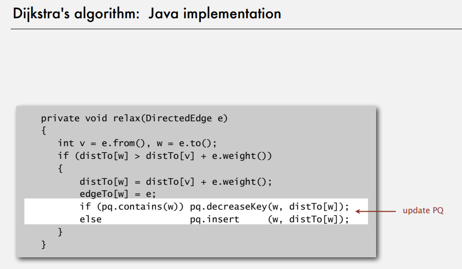

# Tree、Symbol Table
考慮用哪種 sort 應該要考慮  
1. 穩定性:在遇到相同大小時不能交換，並且不可破壞上次排序的結果。通常只要不是鄰近兩兩交換的，都不穩定。(只有merge, insert sort是穩定)  
2. 確定性:有一致的執行過程。快速排序因為一開始會洗牌，所以沒有確定性。  
3. 平行度:快速排序無法平行化  
4. 空間花費:merge sort需要額外空間保存分治過程，無法直接交換。  
  

Symbol Table 實作方法: Binary Search Tree  
1. linklist  
2. 雙陣列分別儲存 key, value。 放入時要排序，可以使用 binary search。  
3. Hibbard Deletion  
   ```
        10
       /  \
      5    20
          /  \
        15    30
   ```
	- case1. 刪除節點在最下面: 把 parent 的 link 設為 nullptr   
	- case2. 刪除節點的兩根腳只有一個有連接(另一個為空): 直接把 parent 的 link 連接到子節點  
	- case3. 刪除節點的兩根腳都有值: 選擇右子樹的最小(往右走一步後往左走到底)，來取代要被刪除的位置。  
      1. 假設要刪除 10，並且用 15 來取代。
      2. 暫存要刪除節點(10)：Node t = x;
      3. 找到並且暫存右子樹的最小節點(15)：x = min(t.right);
      4. 將要取代的暫存節點(15)的右子樹設為，欲刪除節點(10)的右子樹，並且刪除原本的要取代節點(15)：x.right = deleteMin(t.right); 這裡的deleteMin會遞迴找到這個子樹當中最左邊(最小)的節點來刪除。
      5. 最後原本欲刪除的節點，因為沒有人指向他，在java當中，會自己被回收。
   - 注意：Hibbard 刪除可能導致樹不平衡（刪除後樹高增加），實際應用中需謹慎使用。
   【Hibbard Deletion 程式實作】
   


4. 遍歷二元樹的方法 preorder, inorder, postorder (https://www.shubo.io/iterative-binary-tree-traversal/)
5. 紅黑樹: https://www.bilibili.com/video/BV1piF6erE7Y?spm_id_from=333.788.videopod.sections&vd_source=a7ec40e3a00a70629191f9c178661833  


# 幾何搜尋
1. KD-tree: 應用於 range search & nearest neighbor (113-2-PDSA-20250502-h2)  
2. 區間搜尋 interval search tree (113-2-PDSA-20250502-h2)
   
3. 分群  
   1. 階層式分群 hierarchical clustering
      1. 群的距離定義有三種
         1. average linkage (也稱為 centroid): 比較兩群質心的距離
         2. single linkage: 比較兩群最近的距離 (實作等價於 kruskal MST)
         3. complete linkage: 比較兩群最遠的的距離
      2. 用 centroid 舉例。每個點先各自成為一個群（cluster）  
         - 一開始，每個座標都是一個獨立的群，質心就是自己。
      3. 重複合併最近的兩個群
         - 每一輪都找出目前所有還活著的群中，距離最近的兩個群（這裡用的是質心的平方距離，不用開根號，效率較高）。
         - 合併這兩個群，產生一個新的群，新群的質心是兩個舊群質心的加權平均（依照各自點數加權）。
         - 被合併的兩個群標記為「死亡」（alive = false），新群加入到群列表。
      4. 直到群數等於目標數量
         不斷重複合併，直到剩下的群數等於targetClusterCount。
      5. 輸出所有活著的群的質心，並排序
         把所有還活著的群的質心座標收集起來，依照 x、y 排序後輸出。

   2. 圖當中的連通分量(CC)，也是一種分群。
   3. 機器學習當中的非監督式學習，也是一種分群。


# 圖
1. 無向圖
    **鄰接表概念**
    **鄰接表實作** 

   其中Bag是一種 linklist 代表裡面存放的資料 1.無序, 2.可重複  
   例如可以重複執行兩次 adj[v].add(w)，這代表V和W之間有兩條路徑。  
   `(Bag<Edge>[]) new Bag[V];`代表建立V個Bag(linklist)的容器(尚未建立實例)，前面的()代表讓編譯器檢查，linklist內只能存入Edge。但如果用特殊方法繞開編譯器，讓執行時存不同東西到Bag內，根本不會檢查。
   `new Bag<Edge>()`建立Bag的實例。並且實際限制每個Bag的add方法，只能加入Edge。

    **DFS概念**
    **DFS實作**
    **BFS概念**
    **BFS實作** <!-- 迴圈內比一開始初始化多了edgeTo[w]=v，還有distTo[w]邏輯不同 -->
    連通分量(CC)概念
    **連通分量(CC)**  

   `marked [v]`紀錄每個頂點有無被搜尋過，  
   `id [v]`紀錄每個頂點所屬的CC編號，  
   `count`總共有幾組CC。  
   構造函數遍歷每個頂點，如果還沒掃過，就用dfs掃所有連通的點，並且設定同樣的CC編號(id)，最後count+1。

    **連通分量(CC)實作2**  
    **難度** <!-- 4.biconnected compoment指的是，有沒有點移除以後會導致CC失效的。 -->
   <!-- 6. 尤拉路徑: 一筆畫，每個邊只能經過一次(簡單)。 -->
   <!-- 7. 漢米爾頓路徑: 一筆畫，每個頂點只能經過一次(超難)。 -->
   <!-- 8. Bipartite graph (二分圖): 所有頂點分為兩群(紅、白)，所有紅點只能連到白點，所有白點只能連到紅點。-->
   <!-- 9. planarity 畫出平面圖，沒有邊交叉(重疊)。 -->
   <!-- 10. 在交換元素後，問兩張圖是不是一樣。 -->

2. 有向圖 Digraph  
   1. 拓樸排序 Directed acyclic graph, (DAG, 有向無環圖) 113-2-PDSA-20250516-h1 25 min  
      - 【DAG概念】
         
         - 遍歷順序: 從0出發做DFS，`.`代表是相同起點，但是已經走到底，`,`代表是不同的起點，最後順序為(014.52,36)
         - postorder: stack釋放時才將節點加入，得到 (4125063)  
         - topological order: 直接把postorder反過來。得到 (3605214)  

      - 【DAG性質】
         結果不唯一  
         DAG 一定沒有迴圈  

      - 【DAG程式實作】  
         
         使用 DFS 的程式，只要注意白色的部份，加上 stack 紀錄結果。  


   2. 強連通分量 strong components
      【概念】
      
      類似一般的CC(連通分量)，但是在有向圖當中，可能每個點的連接，來回是不同路徑。  
      將圖分成強連通分量以後，可以找到以強連通分量為單位的DAG。  

      【Kosaraju-Sharir 概念】
       **範例輸入**  
       **將所有邊都反向以後，做一次dfs**  
       **按照剛剛結果的順序，在原本沒有反向的圖上，再做一次dfs**  
      正反向各做一次，相當於確保CC內的每個邊，從兩個方向都有路徑可走。

      【Kosaraju-Sharir 實作】
       **連通分量(無向) 實作**
       **強連通分量(有向) 實作**


3. Minumum Spanning Tree, (MST) 最小生成樹 (假設圖都連接、每個邊的權重都不同，這樣結果必定唯一。)
   原本的圖可能會有多個冗餘的邊，如何用最少的邊，把圖中的所有頂點連起來。  
   其中生成樹的所有邊必須相連(不能是兩個斷開的子圖)，必定沒有迴圈。  
   
4. 圖的 cut property (必考):
   - 【性質定義】
      任意切一刀，把圖中的點分為兩群，刀子經過的邊為 crossing edge。  
      該圖的MST路徑，必定包含所有 crossing edge 當中，權重最小的 crossing edge。

   - 【證明-反證法】(必考):
      假設我們的最小生成樹（MST）沒有包含這條權重最小的 crossing edge（記為 e），
      那麼 MST 必定包含其他 crossing edge（記為 f），因為要連接兩邊的點，所以必定會使用到 crossing edge。
      因為 e 的權重比 f 小（e 是所有 crossing edge 中最小的），
      如果我們把 MST 中的 f 換成 e，新的樹會比原本的 MST 權重更小。
      這代表使用 f 的 MST 違反了「最小」的定義。
      因此，假設不成立，所有 crossing edge 中權重最小的那一條，一定會在 MST 當中。
      

5. weighted edge graph 權重邊圖
   之前原本是用vertex(頂點)來建構圖，因為待會MST引入邊的權重，所以改成用edge(邊)來建構圖。
    **權重邊的實作**
    **權重邊圖的架構**
    **權重邊圖的鄰接表(頂點1, 頂點2, 權重)**
    **權重邊圖鄰接表的實作**


6. 貪心 MST 算法:
   每次切一刀後，得到 minumum crossing edge 的兩個點。  
   在以後切的時候，都必須在同一邊，不能被切開。  
   重複切 v-1 次，即可得到 MST。
   不管怎麼切，只要滿足MST一開始的假設，結果就唯一。
   1. Kruskal
      
      - 【算法說明】
         1. **排序所有邊**：將所有邊按權重從小到大排序。
         2. **初始化 Union-find**：每個頂點初始時屬於自己的獨立集合（即父節點指向自己）。
         3. **貪心選擇邊**：檢查每條邊的兩個頂點 (u, v) 是否屬於同一集合，使用 Union-Find 判斷根結點是否相同。
            1. **若屬於不同集合**（即 find(u) != find(v)）：將這條邊加入 MST，並且用 Union 操作合併 u 和 v 所屬的集合。(這代表這條邊不會形成cycle，並且邊的兩個點，在以後切的時候，都必須在同一邊，不能被切開。)
            2. **若屬於同一集合**（即 find(u) == find(v)）：跳過這條邊（加入它會形成環）。
         4. **終止條件**：當已選中 V−1 條邊時停止（V 為頂點數）。(如果跑完所有邊也行，但就多浪費時間，不影響結果。)  

      - 【程式實作】
          **kruskal MST 實作**  
         ```java
         public class KruskalMST {
            private Queue<Edge> mst = new Queue<Edge>();  // 用於儲存 MST 的邊

            public KruskalMST(EdgeWeightedGraph G) {
               // 1. 排序所有邊
               MinPQ<Edge> pq = new MinPQ<Edge>(G.edges());
               // 2. 初始化 Union-find
               UF uf = new UF(G.V());

               // 3. 貪心選擇邊 & 4. 終止條件
               // 當優先級佇列不為空且 MST 的邊數未達到 V-1 時繼續循環
               while (!pq.isEmpty() && mst.size() < G.V() - 1) {

                     // 取得最小邊與對應的兩個頂點
                     Edge e = pq.delMin();  // 取出當前權重最小的邊
                     int v = e.either();    // 獲取邊的一個頂點
                     int w = e.other(v);    // 獲取邊的另一個頂點

                     // 如果兩個頂點屬於不同的Union才合併並且加入MST（避免環）
                     // 如果不滿足則跳過
                     if (!uf.connected(v, w)) {
                        uf.union(v, w);    // 合併兩個Union
                        mst.enqueue(e);    // 將邊加入 MST
                     }
               }
            }

            // 返回 MST 的所有邊
            public Iterable<Edge> edges() {
               return mst;
            }
         }
         ```


   2. Prim   
      從一個頂點開始，逐步擴張MST的邊界，每次從MST鄰近的邊中選擇權重最小的。  
      
      
      **Lazy Prim 概念**

      - 【Lazy Prim 懶惰算法說明】把edge放到優先佇列  
         使用優先級佇列（最小堆）儲存所有邊，可能包含無效邊（已加入MST的頂點）。  
         1. **初始化**：選擇任意起點為MST，將其鄰接邊加入優先級佇列。
         2. **擴張樹**：
            - 從優先級佇列中取出最小權重邊`(u, v)`，其中u是本來就在MST當中的點，v可能在MST中也可能不在。
            - 若`v`不在MST當中，將`(u, v)`加入MST，並將`v`的鄰接邊加入佇列
            - 若`v`已經在MST當中(兩個點都已經在MST當中)，跳過（此為無效邊）
         3. **終止條件**：當MST包含`V−1`條邊時停止

      - 【Lazy Prim 實作】
         ```java
         public class LazyPrimMST {
            private boolean[] marked; // 標記頂點是否已在MST中  
            private Queue<Edge> mst;  // 用於存儲MST的邊  
            private MinPQ<Edge> pq;   // 優先級隊列（最小堆），用於獲取最小權重邊

            public LazyPrimMST(WeightedGraph G) {
               pq = new MinPQ<Edge>();  // 初始化優先級隊列
               mst = new Queue<Edge>(); // 初始化MST邊集合
               marked = new boolean[G.V()]; // 初始化標記數組
               visit(G, 0); // 從頂點0開始構建MST（可選任意頂點）

               // 當優先級隊列不為空且MST邊數未達到V-1時繼續循環
               while (!pq.isEmpty() && mst.size() < G.V() - 1) {
                     Edge e = pq.delMin(); // 取出當前最小權重邊
                     int v = e.either(), w = e.other(v); // 獲取邊的兩個頂點
                     
                     // 如果兩個頂點都已標記，則跳過（避免環）
                     if (marked[v] && marked[w]) continue;
                     
                     mst.enqueue(e); // 將有效邊加入MST
                     
                     // 將未訪問的頂點加入樹，並訪問其鄰接邊
                     if (!marked[v]) visit(G, v);
                     if (!marked[w]) visit(G, w);
               }
            }

            // 從頂點v開始構建MST
            // 將v標記為已訪問，並將其鄰接邊加入優先級隊列
            private void visit(WeightedGraph G, int v) {
               marked[v] = true; // 標記頂點v已訪問
               for (Edge e : G.adj(v)) { // 遍歷v的所有鄰接邊
                     // 只將連接未訪問頂點的邊加入隊列（避免重複處理）
                     if (!marked[e.other(v)]) {
                        pq.insert(e);
                     }
               }
            }

            // 返回MST的所有邊
            public Iterable<Edge> edges() { 
               return mst; 
            }
         }
         ```

      - 【Eager Prim 積極算法說明】把vertex放到優先佇列  
         使用最小優先級佇列維護每個非樹頂點到樹的最小權重邊。  
         - 相對於lazy的優點:不會包含無效邊，並且queue長度使用V(頂點)會比E(邊)更短。
         - 相對於lazy的缺點:實作較難，需要額外更新優先級佇列當中的權重(優先級)。  
           
         
         第一次執行，MST當中只有0。鄰接點只有(4,7,2,6)  
         第二次執行MST當中有0, 7，此時鄰接點變為(4,5,1,3,2,6)，從MST到4的權重需要更新(0.38 -> 0.37)。
         1. **初始化**：維護distTo[]陣列記錄每個頂點到樹的最小邊權重
         2. **擴張樹**：
            - 選擇distTo[]中最小的頂點v，將其對應的邊edgeTo[v]加入MST
            - 更新v的鄰居w的distTo[w]
         3. **終止條件**：當MST包含V−1條邊時停止

      - 【最小優先級佇列 實作】

          **最小優先級佇列 API**  
          **最小優先級佇列 概念 (紅字是qp[i]) (與上面 eager prim 的圖例沒有關係)**  
         最小優先級佇列是使用矩陣實作heap(完全二叉樹)  
         - i代表每個MST外的鄰接點編號
         - key[i]代表每個頂點到MST的最近距離，也就是佇列排序的權重(A最小/最優先)  
         - pq[i]當中的i***不是***頂點編號，而是矩陣的編號。已知矩陣當中的編號i，想找到a[i]裡面存放的頂點是什麼。例如pq[2]=6代表矩陣當中a[2]的位置是放頂點V[6]。  
         - qp則是反過來的pq，已知頂點V[i]，求在矩陣當中的index。例如qp[2]=6代表，頂點V[2]放在矩陣a[6]的位置。  
         修改權重(key)之後，記得要做swim qp[i] (對實際的物理地址往上游)，確保二叉樹的父節點，優先級必定大於自己。


    3. 比較複雜度
       理論上 `prim` Elog()會比 `kruskal` log(E)好一點 因為 E 通常是 V 的平方以上。
       1. Kruskal
          
       2. prim 
          
             

# 最短路徑(有權重的有向圖)
## 權重有向圖的建立
    **權重有向邊的實作**  
   類似先前(圖-5.權重邊圖)的實作，只差在either, other改成from, to(因為有方向性)。

   
   
   

## 通用性質
   ### relax 鬆弛
   
   在BFS過程當中，輸入你現在遍歷的有向邊，如果發現從起點到邊的終點(distTo[w])有更短的路徑，就更新最短距離。

   #### relax 證明
   - 命題:
      distTo[]中儲存的值，確實是從起點s出發的最短路徑，if and only if:  
      1. 起點到自己的距離必須為零: distTo[s]=0
      2. 除非目的v不可從起點抵達，否則distTo[v]是從起點s到目的v的路徑長度
      3. 對每條邊e(from v to w)，需要滿足distTo[w]≤distTo[v]+e.weight()。代表所有走法到w的路徑都>=已經紀錄的最短路徑。
   - iff反向證明
      > 假設存在一條邊使得
      > $distTo[w]>distTo[v]+e.$
      > 則代表當前distTo[w]不是最短路徑，需要被更新為更小的值。
   - iff順向證明
       假設最短路徑上的每一條邊都滿足公式，把每一條邊的結果都相加以後，還是會滿足公式(中間的邊可以消掉)。

   ### 初始化
   起點距離設為0，其他點距離設為無限大。

## 單源最短路徑 具體算法 (只有1個起點, 沒有終點)
### Dijkstra (BFS)(權重不能有負)


Dijkstra 實作

#### Dijkstra 複雜度 O(E*log(V))  
1. 初始化 dist[] 陣列：O(V)。接著把起點加到優先隊列O(V)。小計O(V)
2. 每次從優先隊列取出距離最小的頂點，總共要取V次，每次取出根結點需要logV(因為要刪除+下沉sink操作)。小計O(V*logV)
3. E個邊(路徑)，每個邊都要鬆弛每個鄰接頂點。鬆弛(修改優先隊列的權重並且上浮swim)一次的成本是O(logV)。小計O(E*logV)
4. 合計O(E*logV)

### Topological sort, DAG 有向無環圖 (DFS)(圖不能有環)

利用DAG線性序列的特性可以找到最短路徑  
假設已經跑過DAG得到一個 Topological sort，照這個順序遍歷頂點，對每個頂點檢查鄰接邊，再對每個邊進行鬆弛操作。因為DAG的特性，所以每個邊都只會恰好被經過一次。


#### Topological sort 複雜度 O(V+E)
1. 拓撲排序找到DAG 小計O(V+E)
2. 初始化距離陣列 小計O(V)
   初始化 dist[] 陣列，將所有頂點的距離設為 ∞ 起點設為 0。
3. 鬆弛所有邊 小計O(V+E)
   1. 遍歷所有頂點（O(V)）：
      按拓撲序依次處理每個頂點 u。
   2. 處理所有邊（O(E)）：
      對每個 u，檢查其所有出邊 u→v，並執行鬆弛操作 dist[v] = min(dist[v], dist[u] + w(u→v))。  
      - 每條邊都只會被處理一次。  
      - 因為直接用dist矩陣操作，不用維護優先隊列，因此每次鬆弛只要常數時間，不像dijkstra需要logV。
4. 合計：O(V+E)


### Bellman-Ford (可以負權重, 也可以有環, 但是環整體的權重不能是負的)
 **Bellman Ford 概念**  
 一開始先初始化，然後就開始重複v-1次把所有邊都relax，如果做到某次relax都不更新，可以提早終止。  

#### Bellman-Ford 複雜度 O(VE)  
1. 初始化距離陣列 dist[] ：將所有節點距離設為 ∞, 起點設為 0。 小計O(V) 
2. 主循環執行 V−1 次： (因為在一個沒有負權重環的圖中，最短路徑最差情況是把所有頂點都連一次，而連接V個頂點只需要V-1個邊。) O(V-1)
   - 每次都循環都要relax所有邊 O(E)
   - 小計: O(VE)
3. 再次檢查所有邊是否還能relax，如果還可以，表示圖中有負權重環：小計O(E)
4. 合計：O(VE)

## 三種最短路徑算法 複雜度比較
 **三種最短路徑算法 複雜度比較**

## 最短路徑的應用 Content-aware resizing 裁縫拼接
 維持城堡與人不變形，只縮放不重要的背景部分，並且縮放結果看起來也很合理。  
概念上，算法會找出一系列的接縫，接著利用接縫對圖像做縮放。
1. 首先，我們拿到一張需要縮小的照片
2. 計算照片中每一個像素的灰階強度
3. 找到圖中數條強度較低的seams(接縫)
   
   - 每個像素連接到下方三個鄰居
   - weight of pixel設定為影像強度的差異
   - 找到最短路徑
   - 這個最短路徑的元素最接近，代表移除或膨脹對整體效果最不明顯
4.  Seams 在gradient magnitude圖中的結果
5. 接著我們把這些seams拿掉，就可以拿到一張縮小後的照片。
